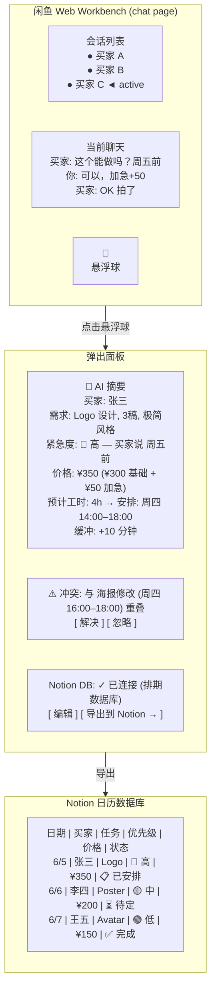
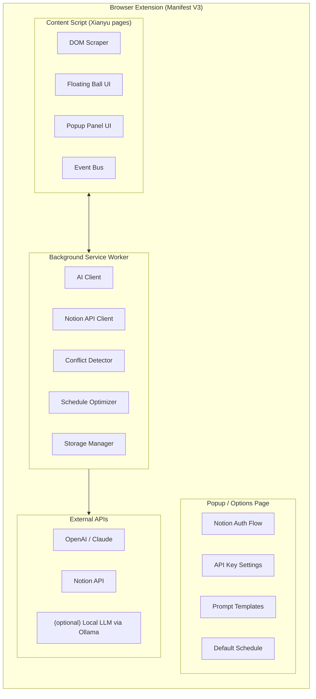
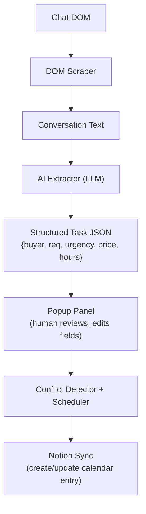

# Goofish Timetable Agent

[中文文档](./README_ZH.md)

A browser extension that brings AI-powered auto-scheduling and Notion calendar sync to the [闲鱼 (Xianyu)](https://seller.goofish.com) web workbench — so you can stop juggling conversations and start shipping on time.

## Problem

When you sell services on Xianyu, deals close in bursts. In a single afternoon you might land 8–10 orders across different chat threads. Without tooling, you have to:

- Manually re-read each conversation to recall what was promised
- Guess deadlines and stack them in your head
- Risk double-booking because two tasks "felt" like they'd fit
- Lose track of which buyer needs what and when

This extension solves that by sitting **beside the Xianyu chat page**, extracting structured task data from each conversation via AI, flagging schedule conflicts, and syncing everything to a Notion Calendar database — with a single review click.

## Core Workflow



## Architecture



### Key Modules

| Module | Responsibility |
|--------|---------------|
| **DOM Scraper** | Extracts chat messages, buyer names, timestamps from Xianyu's page structure. Watches for DOM mutations as new messages arrive. |
| **AI Extractor** | Sends scraped conversation text to an LLM with a structured prompt. Returns JSON: `{buyer, requirement, urgency, price, estimatedHours}`. Supports multiple providers (OpenAI, Claude, local). |
| **Conflict Detector** | Given a new task's start/end time, compares against existing scheduled tasks. Flags overlaps — with the 10-minute buffer baked in. |
| **Schedule Optimizer** | Suggests the earliest available slot that avoids conflicts. Prioritizes by urgency × deadline proximity. |
| **Notion Sync** | Creates/updates pages in a Notion Calendar database. Maps extracted fields to Notion properties. Handles OAuth or integration token auth. |
| **Floating Ball UI** | A draggable `<div>` injected into the Xianyu page. Badge shows pending task count. Click toggles the popup panel. |
| **Popup Panel** | The main interaction surface — auto-filled form, conflict warnings, edit controls, export button. Built as a shadow-DOM widget to avoid style leaks. |

### Data Flow



## Notion Database Schema

The target Notion database should have these properties:

| Property | Type | Description |
|----------|------|-------------|
| **Task Name** | Title | Auto-generated: `[Buyer] - [Requirement Summary]` |
| **Buyer** | Rich Text | Xianyu username |
| **Requirement** | Rich Text | Full requirement description |
| **Urgency** | Select | `🔴 High` / `🟡 Medium` / `🟢 Low` |
| **Price (¥)** | Number | Agreed price in RMB |
| **Est. Hours** | Number | Estimated working hours |
| **Date** | Date | Scheduled date (calendar view anchor) |
| **Start Time** | Date (w/ time) | Task start |
| **End Time** | Date (w/ time) | Task end (includes 10-min buffer) |
| **Status** | Select | `📋 Scheduled` / `🔄 In Progress` / `✅ Done` / `❌ Cancelled` |
| **Chat Link** | URL | Deep link back to Xianyu conversation |
| **Notes** | Rich Text | Any manual notes added during review |

## Tech Stack

| Layer | Choice | Rationale |
|-------|--------|-----------|
| Extension Framework | **Manifest V3** | Current Chrome Web Store requirement |
| Content Script UI | **Vanilla TS + Shadow DOM** | Zero framework weight injected into host page; Shadow DOM prevents style conflicts with Xianyu's CSS |
| Background Worker | **TypeScript** | Type safety across API boundaries |
| AI Provider | **OpenAI / Anthropic / Ollama** | Configurable; default to OpenAI GPT-4o-mini for cost efficiency |
| Notion SDK | **@notionhq/client** | Official JS SDK, tree-shakeable for extension use |
| Build Tool | **Vite + CRXJS** | Fast HMR, native ES module output, first-class extension plugin |
| Package Manager | **pnpm** | Per CLAUDE.md preference |
| Linting | **ESLint + Prettier** | Standard TS config |

## Project Structure

```
goofish_timetable_agent/
├── README.md
├── package.json
├── pnpm-lock.yaml
├── vite.config.ts
├── tsconfig.json
├── manifest.json              # CRXJS generates from this
├── public/
│   └── icons/                 # Extension icons (16, 48, 128)
├── src/
│   ├── content/               # Content script (injected into Xianyu)
│   │   ├── index.ts           #   Entry: mount floating ball + scraper
│   │   ├── scraper.ts         #   DOM scraping logic
│   │   ├── floating-ball.ts   #   Floating ball component
│   │   ├── popup-panel.ts     #   Popup panel (form, conflict display)
│   │   └── styles.css         #   Shadow DOM styles
│   ├── background/            # Service worker
│   │   ├── index.ts           #   Entry: message router
│   │   ├── ai-client.ts       #   LLM API wrapper
│   │   ├── notion-client.ts   #   Notion API wrapper
│   │   ├── conflict-engine.ts #   Schedule conflict detection
│   │   └── scheduler.ts       #   Optimal slot finder
│   ├── shared/                # Shared types & utilities
│   │   ├── types.ts           #   Task, Settings, API response types
│   │   ├── prompts.ts         #   AI prompt templates
│   │   └── constants.ts       #   Selectors, URLs, defaults
│   ├── popup/                 # Extension toolbar popup (settings)
│   │   ├── index.html
│   │   ├── index.ts
│   │   └── App.vue            #   Vue + Naive UI (per CLAUDE.md)
│   └── options/               # Full options page
│       ├── index.html
│       ├── index.ts
│       └── Options.vue
└── tests/
    ├── unit/
    │   ├── scraper.test.ts
    │   ├── conflict-engine.test.ts
    │   ├── scheduler.test.ts
    │   └── ai-client.test.ts
    └── e2e/
        └── flow.test.ts
```

## AI Prompt Design

The core extraction prompt sent to the LLM:

```
You are a scheduling assistant. Given a Xianyu conversation, extract structured data.

Conversation:
---
{chat_messages}
---

Return ONLY valid JSON (no markdown, no explanation):
{
  "buyerName": "string",
  "requirement": "concise summary in Chinese",
  "urgency": "high" | "medium" | "low",
  "urgencyReason": "brief reason for urgency level (quote key phrases)",
  "price": number or null,
  "estimatedHours": number,
  "deadline": "ISO date string or null",
  "specialNotes": "any constraints or special requests"
}
```

### Urgency Heuristics (also coded as fallback rules)

| Signal | Urgency |
|--------|---------|
| "急" / "尽快" / "马上" / "今天" / "明天" / deadline within 48h | 🔴 High |
| "这周" / "本周" / "几天内" / deadline within 7 days | 🟡 Medium |
| No time pressure mentioned / "不急" / "有空再做" | 🟢 Low |

### Price × Urgency Adjustment Rule

```
If urgency == "high"   → suggest price = max(scraped_price, default_base × 1.3)
If urgency == "medium" → suggest price = max(scraped_price, default_base × 1.0)
If urgency == "low"    → suggest price = max(scraped_price, default_base × 0.9)
```

This encodes the strategy: **urgent tasks cost more, low-priority tasks can be discounted to fill gaps.**

## Conflict Detection Algorithm

```
Given:  new_task(start, end)  where end already includes +10min buffer
        existing_tasks[]      each with (start, end)

For each existing_task:
    if new_task.start < existing_task.end AND new_task.end > existing_task.start:
        → CONFLICT (overlap)

Suggested resolution:
    earliest_slot = now
    for each existing_task (sorted by start):
        if earliest_slot + new_task.duration <= existing_task.start:
            return earliest_slot   # gap found
        earliest_slot = max(earliest_slot, existing_task.end)
    return earliest_slot           # slot after all existing tasks
```

The 10-minute buffer ensures no back-to-back task starts exactly when another ends — giving breathing room between sessions.

## Setup & Development

### Prerequisites

- Node.js 18+ (managed via nvm)
- pnpm (per project convention)
- A Notion integration token ([create one here](https://www.notion.so/my-integrations))
- An OpenAI API key (or Anthropic / local Ollama endpoint)
- A Notion Calendar database (duplicate the template — link TBD)

### Quick Start

```bash
# Clone
git clone <repo-url> && cd goofish_timetable_agent

# Install
pnpm install

# Configure
cp .env.example .env
# Fill in: NOTION_TOKEN, OPENAI_API_KEY, NOTION_DATABASE_ID

# Build both browser targets
pnpm build

# Or build a single target
pnpm build:chrome
pnpm build:firefox

# Test
pnpm test          # unit tests
pnpm test:e2e      # end-to-end (requires Chrome)
```

### Build

```bash
pnpm build          # build both targets → dist/chrome + dist/firefox
pnpm build:chrome   # build Chrome target only
pnpm build:firefox  # build Firefox target only
pnpm build:zip      # zip dist/chrome for Chrome Web Store submission
```

### Debugging In Chrome

1. Run `pnpm build:chrome` or `pnpm build`.
2. Open `chrome://extensions`.
3. Enable `Developer mode`.
4. Click `Load unpacked`.
5. Select `dist/chrome`.
6. Open any page and inspect the page DevTools for content-script logs.
7. Open the extension's service worker inspector from `chrome://extensions` for background logs.

### Debugging In Firefox

1. Run `pnpm build:firefox` or `pnpm build`.
2. Open `about:debugging#/runtime/this-firefox`.
3. Click `Load Temporary Add-on...`.
4. Select `dist/firefox/manifest.json`.
5. Open any page and inspect the page DevTools for content-script logs.
6. Use the extension's `Inspect` action in `about:debugging` for background logs.
7. Re-run the build after code changes, then reload the temporary add-on.

### Browser Target Notes

- `dist/chrome` uses a Manifest V3 background service worker.
- `dist/firefox` rewrites the same background entry into `background.scripts`, because Firefox uses document/event-page background scripts for this case.
- Background logic must stay stateless across unloads. Persist anything durable in `storage.local`, not module globals.
- The extension currently injects on `<all_urls>` for development debugging convenience. UI can appear on any page, but extraction only works on pages whose DOM matches the supported chat structure.
- Broad `content_scripts` and `host_permissions` cause broad install prompts. Firefox shows these prompts for Manifest V3 host permissions from Firefox 127 onward; Chrome shows them in the install prompt as well.

## Roadmap

| Phase | Feature | Status |
|-------|---------|--------|
| **P0** | DOM scraper for Xianyu chat pages | 🚧 Planned |
| **P0** | AI extraction pipeline (OpenAI) | 🚧 Planned |
| **P0** | Floating ball + popup panel UI | 🚧 Planned |
| **P0** | Conflict detection engine | 🚧 Planned |
| **P0** | Notion calendar sync (create) | 🚧 Planned |
| **P1** | Notion calendar sync (update) | 💡 Backlog |
| **P1** | Multi-provider AI (Claude, Ollama) | 💡 Backlog |
| **P1** | Drag-to-reorder in popup timeline | 💡 Backlog |
| **P1** | Bulk export — select multiple convos | 💡 Backlog |
| **P1** | Settings page (Vue + Naive UI) | 💡 Backlog |
| **P2** | Price history & earnings dashboard | 💡 Backlog |
| **P2** | Auto-reply templates triggered by schedule | 💡 Backlog |
| **P2** | Mobile companion (PWA or mini-app) | 💡 Backlog |

## Privacy & Security

- **All AI calls go directly from your browser** to the configured API endpoint. No third-party server sits in between.
- **Notion token and API keys** are stored in the extension's `storage.local` area.
- **Chat content is processed ephemerally** — no conversation data is persisted beyond the current extraction session unless explicitly exported to Notion.
- The development build injects on `<all_urls>` so the floating widget can be debugged on any page. The scraper still depends on the target page exposing the expected chat DOM.

## Contributing

This project follows strict TDD (per CLAUDE.md). Every feature starts with a failing test.

1. Fork & branch
2. Write a failing test → implement → pass
3. Commit granularly (one feature per commit, no AI attribution)
4. PR with test coverage report

## License

MIT
